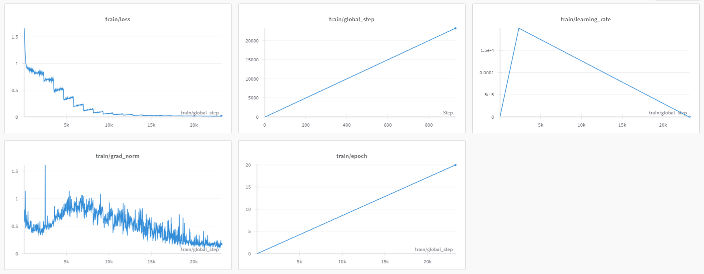

# my-first-ai

# hugging-face
 - dataset: `https://huggingface.co/datasets/seoma/korquad2-dev`
 - model: `https://huggingface.co/seoma/Llama2-KorQuAD2-dev-finetuning`

# training report

[detail is here](https://api.wandb.ai/links/seo-ma/iq4tjyc9)

---
tags:
- autotrain
- text-generation-inference
- text-generation
- peft
library_name: transformers
widget:
  - messages:
      - role: user
        content: What is your favorite condiment?
license: other
---

# Model Trained Using AutoTrain

This model was trained using AutoTrain. For more information, please visit [AutoTrain](https://hf.co/docs/autotrain).

# Usage

```python

from transformers import AutoModelForCausalLM, AutoTokenizer

model_path = "seoma/Llama2-KorQuAD2-dev-finetuning"

tokenizer = AutoTokenizer.from_pretrained(model_path)
model = AutoModelForCausalLM.from_pretrained(
    model_path,
    device_map="auto",
    torch_dtype='auto'
).eval()

# Prompt content: "hi"
messages = [
    {"role": "user", "content": "hi"}
]

input_ids = tokenizer.apply_chat_template(conversation=messages, tokenize=True, add_generation_prompt=True, return_tensors='pt')
output_ids = model.generate(input_ids.to('cuda'))
response = tokenizer.decode(output_ids[0][input_ids.shape[1]:], skip_special_tokens=True)

# Model response: "Hello! How can I assist you today?"
print(response)
```

### License
`KorQuad 2.0` [CC BY-ND 2.0 KR](https://creativecommons.org/licenses/by-nd/2.0/kr/)
